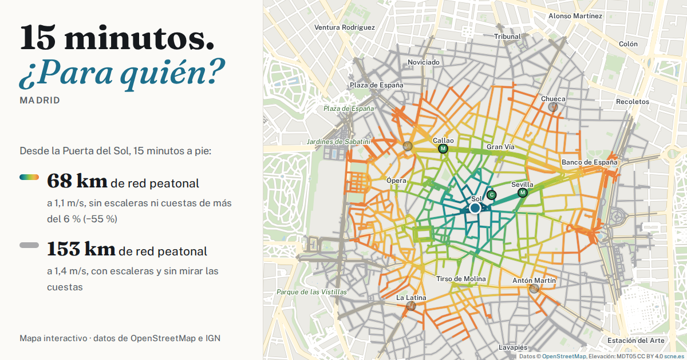

# 15 minutos. ¿Para quién? · Madrid

Mapa interactivo que muestra hasta dónde llegas andando por Madrid en un tiempo dado, y cómo cambia según tu velocidad y si puedes usar escaleras. Los mismos 15 minutos no llegan igual de lejos para todo el mundo.

**Pruébalo:** https://pablolamiquiz.github.io/15--minutos-madrid/

## Qué hace

- Haz clic en el mapa, arrastra el punto o busca una calle, estación o parque.
- Ajusta el tiempo (5 a 30 min) y la velocidad al caminar (0,8 a 1,8 m/s, el rango del metaestudio de [Giannoulaki y Christoforou, 2024](https://www.mdpi.com/2818476)).
- Marca «Evitar escaleras» para quitar los tramos de escaleras mapeados, y «Escaleras» para verlos en rojo en el mapa.
- En color, las calles que alcanzas con tus ajustes; en gris, las que alcanzaría en el mismo tiempo alguien a 1,4 m/s que puede usar escaleras.
- El panel cuenta servicios (alimentación, salud, educación, parques, cafés y restaurantes), bancos, paradas de bus y estaciones al alcance, y cuántas estaciones están etiquetadas como accesibles.
- «Compartir esta vista» guarda el punto y los ajustes en la dirección, así que el enlace abre exactamente lo que estabas viendo.
- En español y en inglés.

## Cómo funciona

No hay servidor. La red peatonal de Madrid viaja con la página (`data/`, unos 2,8 MB comprimidos) y el navegador calcula el recorrido con el algoritmo de Dijkstra. El mapa base también se dibuja en el navegador a partir de los mismos datos, así que no depende de ningún servicio de teselas.

- `data/graph.bin.gz`: red peatonal (145.487 nodos y 207.507 tramos; 4.536 son escaleras), más las líneas de contexto del mapa (autovías, tren, ríos).
- `data/extra.json.gz`: 39.120 puntos de interés, nombres, parques y agua.
- Zona cubierta: 7 km alrededor de la Puerta del Sol (prácticamente todo el interior de la M-30 y parte de fuera).
- Datos: extracto de OpenStreetMap de Geofabrik, 30 de septiembre de 2026.

Para verlo en tu ordenador, abre un Terminal en esta carpeta y ejecuta `python3 -m http.server 8000`. Después ve a http://localhost:8000 (abrir `index.html` con doble clic no funciona, porque la página tiene que cargar los ficheros de `data/`).

## Limitaciones

- No incluye transporte público, cuestas, bordillos, estado de las aceras ni iluminación. «Evitar escaleras» no equivale a una ruta en silla de ruedas.
- OpenStreetMap está incompleto en algunos sitios. Una estación solo cuenta como accesible si está etiquetada `wheelchair=yes`, y muchas no tienen la etiqueta.
- Los servicios se asignan al cruce más cercano y los parques cuentan como un solo punto, así que los recuentos cerca del borde son aproximados.

## Ideas para seguir

- Cuestas, con el modelo digital del terreno MDT05 del CNIG.
- Inventario oficial de bancos del Ayuntamiento ([datos.madrid.es](https://datos.madrid.es/dataset/300095-0-mobiliario-bancos)).
- Accesos de metro con ascensor, fuentes de agua, sombra.
- Actualizar los datos de OpenStreetMap periódicamente.

## Créditos y licencias

- Basado en [«15 minutes. For whom?»](https://github.com/martincantcode/15-minutes) de Martin Bangratz, a su vez inspirado en la ciudad de 15 minutos de Carlos Moreno. Código bajo licencia MIT (ver `LICENSE`). Esta versión adapta la página a Madrid, la traduce y añade el mapa base propio, el buscador, los enlaces para compartir y la versión en inglés.
- Datos © colaboradores de [OpenStreetMap](https://www.openstreetmap.org/copyright). Los ficheros de `data/` son una base de datos derivada de OpenStreetMap y están disponibles bajo la [Open Database License (ODbL)](https://opendatacommons.org/licenses/odbl/).
- Leaflet (BSD-2), fflate (MIT) y las tipografías Fraunces y Public Sans (SIL OFL 1.1): ver `vendor/LICENSES.md`.

---

## English

Interactive map of how far you can walk in Madrid in a given time, and how that changes with walking speed and with avoiding stairs. Based on [“15 minutes. For whom?”](https://github.com/martincantcode/15-minutes) by Martin Bangratz (MIT). Everything runs in the browser on OpenStreetMap data (© OpenStreetMap contributors, ODbL) bundled in `data/`; there is no server and no tile service. Covers 7 km around Puerta del Sol. Use the ES/EN switch on the page.
